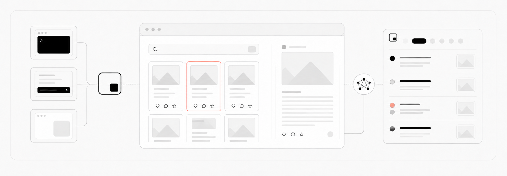

<div align="center">

<a href="https://socai.io/?utm_source=github&amp;utm_medium=readme&amp;utm_campaign=main-repo-logo">
  
</a>

# socai

[English](README.md) · [简体中文](README.zh-CN.md) · **日本語** · [한국어](README.ko.md)

**複数のソーシャルメディアを横断調査するローカルエージェント**

ログイン済みの Chrome に接続し、小紅書、抖音、TikTok、Instagram、LinkedIn の投稿・コメント・画像・動画・プロフィールを調査します。

[公式サイト](https://socai.io/?utm_source=github&utm_medium=readme) · [ダウンロード](#デスクトップアプリ) · [クイックスタート](#クイックスタート) · [対応プラットフォーム](#対応プラットフォーム) · [開発ドキュメント](DEVELOPMENT.md)

[](https://github.com/socai-io/socai/releases/latest)
[](#デスクトップアプリ)
[](LICENSE)

<br>

<a href="https://socai.io/?utm_source=github&amp;utm_medium=readme&amp;utm_campaign=main-repo-banner">
  
</a>

</div>

## 概要

socai は、小紅書、抖音、TikTok、Instagram、LinkedIn に対応するローカルのソーシャルメディアエージェント基盤です。Chrome DevTools Protocol（CDP）を通じて実際のブラウザーに接続し、既存のログイン状態を再利用します。検索、投稿や動画の閲覧、コメントと返信の展開、著者・人物・企業ページの確認を通常の画面操作で行い、結果を構造化データとローカル成果物として保存します。

主な利用例：

- カテゴリー内で新しく生まれた話題、感情、表現の追跡
- 投稿とコメント欄から、ニーズ、不安、購買判断の言葉を抽出
- 複数プラットフォームでのブランド、商品、店舗、キャンペーンに対する反応の比較
- クリエイター、人物、企業、投稿方針、人気投稿、読者反応の分析
- 画像・動画の保存、OCR、動画音声文字起こしによる証拠の補完

現在は読み取りと調査を中心に提供しており、投稿、いいね、保存、コメントなどの書き込み操作は提供していません。

https://github.com/user-attachments/assets/8aebcded-f365-4f12-b9c4-102cc1fa964d

## 主な機能

| 機能 | 内容 |
| --- | --- |
| 実ブラウザー操作 | 普段使っている Chrome に接続し、ページ上の操作経路に沿ってタスクを実行します。 |
| 投稿・コメントの深読 | タイトル、本文、著者、反応数、コメント、返信を取得します。 |
| マルチモーダル理解 | 投稿画像と動画の保存、ローカル画像 OCR、動画音声文字起こしに対応します。 |
| クロスプラットフォーム調査 | 各サイト固有の検索、プロフィール、投稿、コメント、返信、スクロール読み込みを利用します。 |
| 証拠と成果物の保存 | 構造化結果、メディア一覧、レポートや表などを保存し、後から確認できます。 |
| 複数の操作画面 | デスクトップアプリ、CLI、ターミナル UI が同じ Rust コアを共有します。 |
| エージェント連携 | Claude Code、Codex などが扱いやすい構造化 JSON を返します。 |

## クイックスタート

### デスクトップアプリ

コマンドラインを設定せず、自然言語で調査タスクを入力できます。macOS と Windows に対応しています。

- [macOS 版をダウンロード](https://github.com/socai-io/socai/releases/latest/download/socai-macos-universal.dmg)
- [Windows 版をダウンロード](https://github.com/socai-io/socai/releases/latest/download/socai-windows-x86_64-setup.exe)

インストール後、画面の案内に従って Chrome を接続し、次のようなタスクを入力します。

> 小紅書、抖音、Instagram で無糖茶がどのように語られているかを比較し、繰り返し現れる購入基準を、具体的な投稿、動画、コメント、返信を引用して整理してください。

既存の Chrome へ初めて接続するときは、リモートデバッグを有効にし、ブラウザーの許可を確認します。[Chrome 接続ガイド](https://socai.io/connect)を参照してください。

デスクトップアプリでは、タスク履歴と成果物を保存し、レポート、表、画像などをプレビューまたはダウンロードできます。結果を Feishu のドキュメントやグループチャットへ出力することもできます。

### コマンドライン

CLI は Claude Code、Codex などのエージェント連携や、構造化データを使うワークフローに適しています。

macOS：

```bash
curl -fsSL https://github.com/socai-io/socai/releases/latest/download/install.sh | sh
```

Windows PowerShell：

```powershell
$installer = Join-Path $env:TEMP 'socai-install.ps1'; Invoke-WebRequest -UseBasicParsing https://github.com/socai-io/socai/releases/latest/download/install.ps1 -OutFile $installer; Unblock-File $installer; & $installer
```

構造化されたプラットフォーム検索を実行します。

```bash
socai xhs search "初心者向けキャンプ用品" --num-notes 10 --num-comments 8 --pretty
socai dy search "キャンプ用品" --num 20
socai tiktok search "camping gear" --num 20 --pretty
```

サブコマンドなしで `socai` を実行すると、Instagram のプロフィール、投稿、Reels、コメントや、LinkedIn の人物、企業、投稿、職歴を含む横断調査をエージェントに依頼できます。

利用中の環境にビルド済みバイナリがない場合や、ソースから開発するときは Cargo を利用できます。

```bash
git clone https://github.com/socai-io/socai.git
cd socai
cargo install --path cli --force
cargo install --path asr --force
```

2 番目のコマンドはローカル Whisper helper を `socai` と同じ場所にインストールします。非課金またはオフラインの文字起こしで内蔵モデルを使うために必要です。

### ターミナル UI

CLI のインストール後、サブコマンドを付けずに `socai` を実行します。

```bash
socai
```

## 利用方法

| 方式 | 適した用途 | 開始方法 |
| --- | --- | --- |
| デスクトップアプリ | 自然言語タスク、履歴、成果物の確認とダウンロード | macOS または Windows 版をインストール |
| CLI | エージェント連携、スクリプト、構造化 JSON | `socai xhs ...`、`socai dy ...`、`socai tiktok ...` を実行 |
| ターミナル UI | ターミナルで連続タスクを手動実行 | `socai` を実行 |

## 対応プラットフォーム

| プラットフォーム | 調査機能 | 利用方法 |
| --- | --- | --- |
| 小紅書 | 検索、著者、投稿、コメントと返信、メディア保存、OCR、文字起こし | エージェントと構造化 CLI |
| 抖音 | 検索、動画詳細、著者、コメントと返信、メディア成果物 | エージェントと構造化 CLI |
| TikTok | 検索、動画詳細、著者プロフィール、コメントと返信、動画保存 | エージェントと構造化 CLI |
| Instagram | キーワード検索、プロフィール、投稿、Reels、コメントと返信、動画保存 | エージェントワークフロー |
| LinkedIn | 人物・企業・コンテンツ検索、プロフィール、職歴、関係情報、投稿、コメント | エージェントワークフロー |

すべて読み取り専用です。socai がフォロー、接続、投稿、いいね、リアクション、コメント、返信、メッセージ送信を代行することはありません。

## プラットフォームコマンド

### 小紅書

#### 投稿を検索して深く読む

```bash
socai xhs search "コンテンツ企画" \
  --num-notes 30 \
  --num-comments 20 \
  --filter publish_time=一周内 \
  --filter sort=最多评论 \
  --download-media \
  --ocr \
  --pretty
```

`search` は検索結果を開いて本文とコメントを読み取ります。`--preview` を付けると、投稿詳細を開かずにタイトル、カバー、反応数などの概要だけを返します。

#### 著者と投稿を読む

```bash
socai xhs author <author_id> --num-notes 10 --num-comments 8
```

投稿概要だけを取得する場合：

```bash
socai xhs author <author_id> --num-notes 20 --preview
```

#### 指定投稿を再取得する

`search` または `author` が返した投稿 ID と `xsec_token` を利用します。

```bash
socai xhs get-notes \
  --note '<note_id>=<xsec_token>' \
  --note '<note_id>=<xsec_token>' \
  --num-comments 20
```

#### 主なオプション

| オプション | 内容 |
| --- | --- |
| `--num-notes <N>` | 取得する投稿数。必要に応じてページをスクロールします。 |
| `--num-comments <N>` | 投稿ごとのコメントと返信数。`0` でコメントを省略します。 |
| `--preview` | 検索結果または著者ページの投稿概要だけを読み取ります。 |
| `--download-media` | 開いた投稿の画像と動画を保存します。 |
| `--ocr` | 投稿画像または動画カバーにローカル OCR を実行します。 |
| `--transcribe-audio` | 開いた動画を保存して音声を文字起こしします。socai agent へのログインと選択が必要です。 |
| `--filter <group=option>` | 小紅書の検索フィルター。複数回指定できます。 |
| `--pretty` | 最終 JSON を読みやすく整形します。 |

フィルター値は小紅書 Web 画面の中国語表記をそのまま使用します。

| グループ | 値 |
| --- | --- |
| `sort` | 综合, 最新, 最多点赞, 最多评论, 最多收藏 |
| `note_type` | 不限, 视频, 图文 |
| `publish_time` | 不限, 一天内, 一周内, 半年内 |
| `search_scope` | 不限, 已看过, 未看过, 已关注 |
| `distance` | 不限, 同城, 附近 |

### 抖音と TikTok

```bash
socai dy search "コーヒー" --num 30
socai tiktok search "coffee" --num 30 --pretty
```

動画詳細、著者、コメント、メディア保存、診断コマンドは `socai dy --help` または `socai tiktok --help` で確認できます。

## ブラウザーとログイン

| モード | 用途 | 動作 |
| --- | --- | --- |
| `existing` | 日常利用、既定値 | 既存 Chrome と対応プラットフォームのログインを再利用 |
| `managed` | 普段の閲覧環境と分離 | `~/.socai/chrome-profile` を使用し、初回のみログイン |
| `auto` | 接続方式の自動選択 | 独立プロファイルを試し、失敗時は既存 Chrome へ接続 |
| `remote` | クラウドブラウザーのテスト | セッション制限のある socai pro ベータ機能 |

設定は `~/.socai/config.json` に保存され、CLI とデスクトップアプリで共有されます。

独立プロファイルへ切り替える場合：

```bash
socai config set chrome.profile managed
socai stop
```

既存 Chrome に戻す場合：

```bash
socai config set chrome.profile existing
socai stop
```

クラウドブラウザーを利用する場合：

```bash
socai pro activate <invite_code>
socai config set chrome.profile remote
```

## 実行結果と成果物

各実行の結果は、既定で次の場所に保存されます。

```text
~/.socai/runs/<timestamp>_<task>/
```

構造化結果、投稿・著者データ、ダウンロードした画像や動画、OCR 結果、`media_manifest.json`、レポートや表などが含まれます。

保存先は変更できます。

```bash
socai config set runs.dir "$(pwd)/socai-runs"
```

## 拡張と開発

新しいサイトや機能を追加する場合は、[サイト拡張ガイド](core/src/sites/creation/SKILL.md)を参照してください。ローカル開発、ビルド、リポジトリ規約は [DEVELOPMENT.md](DEVELOPMENT.md) にあります。

## コミュニティ


利用方法、調査ワークフロー、機能提案に関するフィードバックを歓迎します。

## ライセンス

socai は [Apache License 2.0](LICENSE) の下で公開されています。
