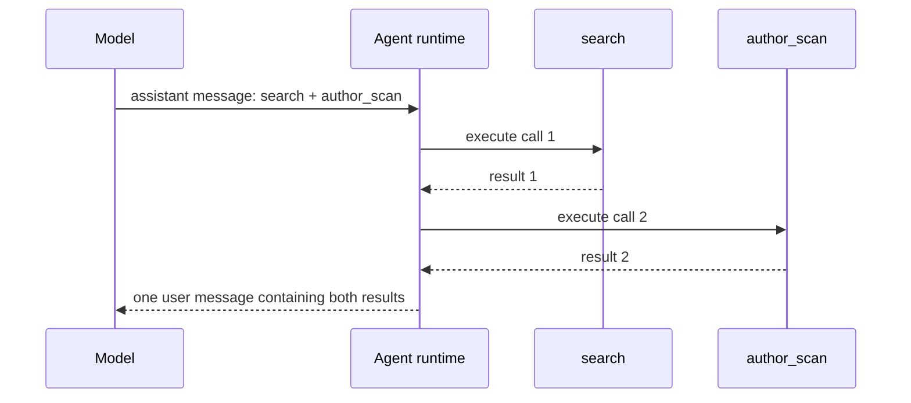
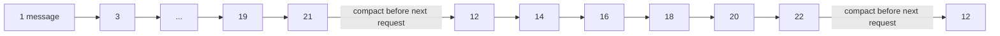

# Context Window Management

This document describes how socai builds, bounds, and compacts the agent
context used by the CLI/TUI and desktop app. The shared implementation lives in
`core/src/agent/` and is used by every entrypoint.

## Terminology

- A **conversation turn** is one persisted user request and its final assistant
  report. A follow-up turn seeds the next agent run with two messages per prior
  turn: the user request and the assistant Markdown report.
- A **step** is one iteration of the in-run agent loop and normally corresponds
  to one LLM request and response.
- A **tool call** is one action requested by the model inside a step. One step
  may contain multiple tool calls.

| Concept | Concrete example | Messages added to the active transcript |
| --- | --- | ---: |
| Conversation turn | User asks a question and receives the final Markdown report | Two seed messages in the next turn |
| Step without tools | Model returns the final answer | The run ends |
| Step with one tool | Model calls `search`, then receives its result | Two messages |
| Step with two tools | Model calls `search` and `author_scan` together | Still two messages |

When a step contains tool calls, socai appends one assistant message containing
all `tool_use` blocks, executes the tools sequentially in model-specified order,
and appends one user message containing all matching `tool_result` blocks. The
next step receives all of those results together. A tool-using step therefore
adds two full messages regardless of whether it contains one or several tool
calls.

The base system prompt tells the model to issue at most two tool calls in one
assistant step and to wait for their results before planning more work. This is
a model-visible scheduling policy, not a parallel executor or a hard runtime
truncation rule. The runtime remains sequential and does not silently discard
additional calls if a provider violates the instruction.

For example, two calls in one step are scheduled like this:



The model chooses the calls. The prompt asks it to choose no more than two;
the runtime executes those calls in order rather than concurrently.

## Context layers

The request context has four relevant layers:

1. The system prompt, site playbook, current date, available tool names, and
   entrypoint-specific instructions.
2. Seed messages from earlier conversation turns.
3. Full assistant/tool-result messages from the current agent run.
4. A deterministic compacted-context message after the history crosses the
   sawtooth threshold.

| Layer | Typical contents | Can compaction shorten it? |
| --- | --- | --- |
| System | Rules, date, tool names, site instructions | No |
| Earlier turns | User requests and final Markdown reports | Yes, after they enter the old region |
| Recent in-run history | Assistant tool calls and tool results | No; the newest 10 messages stay verbatim |
| Older in-run history | Earlier tool calls and structured results | Yes, to post metadata and artifact paths |
| Run artifacts | Full JSON, OCR, media, requests, responses | No |

Run artifacts are the durable evidence store. Context compaction changes only
what is replayed to the model; it does not rewrite or truncate the JSON, media,
LLM request/response, or tool-call records saved under the run directory.

## Tool-result bounds before history compaction

Every raw tool result is written to its tool-call directory before the result is
bounded for model history. The LLM-facing text has a 30,000-character ceiling.
If an oversized result is JSON, degradation happens in this order:

1. For XHS search/author results with an artifact pointer, keep every returned
   post as a metadata-first record using all fields available in the lean tool
   result: note ID, title, author, author ID, URL, date, type, engagement
   counts, a bounded body excerpt, and a small comment/reply sample. Full OCR,
   media, bodies, comment threads, location, and hashtags remain in the
   artifact when those fields were removed by the artifact-first tool shape.
   If the full metadata view still exceeds the ceiling, reduce it through
   identity-only and ID-only valid JSON forms. An extreme result that cannot
   fit every ID keeps a valid artifact index with retained and omitted counts.
2. Cap each `ocr_text` value to 1,000 characters in total. For string arrays,
   keep complete leading entries until the budget is exhausted and mark the
   truncation.
3. Replace `top_comments` with an artifact pointer marker if the result is still
   too large.
4. Compact JSON objects, arrays, and string leaves while keeping note body text
   longer than generic strings.
5. Apply a final character truncation only as a last resort.

Xiaohongshu search and author-scan results are already artifact-first before
this generic limit runs. Their full artifacts retain per-image OCR. The lean
tool result exposes OCR from at most the first two cover-first images per note,
with each returned image text capped at 1,200 characters.

Example for a three-image note:

| Location | OCR retained |
| --- | --- |
| `artifacts/search/*.json` | Images 1, 2, and 3, including their complete per-image OCR fields |
| LLM-facing `search` result | OCR summaries for images 1 and 2 only, each capped at 1,200 characters |
| Later compacted context | Available note metadata and artifact path; OCR text is removed |

## Sawtooth message window

The default window uses two values:

- compact after the transcript grows beyond 20 full messages;
- retain the most recent 10 full messages verbatim.

For a fresh run with one initial user message and one tool-using step at a time,
the transcript grows as `1 + 2 * steps`. Ten completed tool-using steps produce
21 messages, so compaction runs immediately before the next model request.

At a compaction point, socai rewrites the in-memory transcript to:

1. the original first message;
2. one deterministic compacted-context message;
3. the most recent 10 full messages.

The recent tail then grows normally until the next threshold. Rewriting only at
these points creates a sawtooth window and keeps the request prefix stable
between compactions, which is friendlier to provider prompt caching than
regenerating a different summary before every request.

The first two compaction cycles look like this when every step uses tools:

| Moment | Full-message count before the request | Action |
| --- | ---: | --- |
| Initial task | 1 | Send unchanged |
| Step 10 | 19 | Send unchanged; its tool call and result grow history to 21 |
| Step 11 | 21 | Compact to 12, then send |
| Step 15 | 20 | Send unchanged; its tool call and result grow history to 22 |
| Step 16 | 22 | Compact to 12 again, then send |



The post-compaction count is 12: the original message, one compacted-context
message, and 10 recent messages.

## Compacting earlier conversation turns

Prior turns are seeded as user text followed by an assistant Markdown report.
When those messages move into the compacted region, socai emits compact Markdown
for each recognized report containing:

- up to 1,000 characters of its associated user request, preserving the start
  and end when the middle must be removed;
- up to 3,000 characters of the assistant report, preserving the opening
  analysis and closing conclusions;
- every note citation found in the full report using the canonical
  `[title](note:NOTE_ID)` form;
- artifact links found in the full report when their targets point into known
  run artifact locations such as `artifacts/`, `tools/`, `snapshots/`,
  `site_media/`, or an absolute `.socai/runs/` path.

Evidence extraction scans the complete Markdown report, including content
outside the 3,000-character compact view. Request and report excerpts are HTML-
escaped inside `<pre>` blocks so a cut cannot leave an open Markdown construct.
At the next sawtooth point, prior turns and artifact entries are parsed back
into structured blocks, deduplicated, and rendered within a 48,000-character
aggregate ceiling.

For example, suppose an older turn ends with a 3,000-character report whose
last section contains these links:

```markdown
[A useful note](note:note-123)
[Full search result](artifacts/search/coffee.json)
```

Its compact representation is shaped like this:

```markdown
### Turn 1
User request:
<pre>
<opening request text>

[middle omitted; full request remains in the conversation record]

<closing request text>
</pre>

Assistant report excerpt:
<pre>
<opening report text>

[middle omitted; full report remains in the run artifact]

<closing conclusions>
</pre>

Extracted evidence:
- note_id: note-123; title: A useful note
- artifact: artifacts/search/coffee.json
```

The links are retained even when they appear outside the compact view because
evidence extraction scans the complete report. Ordinary Markdown such as a task
checkbox (`[x]`) is ignored and cannot consume a later link's title.

Markdown without canonical note links cannot yield a reliable note ID or title.
Likewise, a run path that never appears as a Markdown link is not inferred from
free-form prose. The desktop/TUI conversation preamble separately lists earlier
run directories and `notes.json` evidence so the agent can use `read_file` when
it needs full cross-turn details.

## Compacting earlier structured tool results

Older `tool_result` text is parsed as JSON. When the result contains an
`artifact.path`, the compacted context retains:

- the artifact path;
- note IDs, titles, authors, author IDs, URLs, dates, note types, and available
  engagement counts from `notes` or `cards`, accepting either direct entities
  or `{ "entity": ... }` wrappers;
- an author ID and available profile name for author-scan results.

Body text, OCR, comments, timing details, and other large fields are omitted
from this later sawtooth representation. The artifact path remains the durable
lookup key. Duplicate entity entries merge non-empty fields so a later sparse
card cannot replace richer metadata.

For example, this older tool result:

```json
{
  "artifact": { "path": "artifacts/search/coffee.json" },
  "notes": [
    {
      "note_id": "note-123",
      "title": "A useful note",
      "author": "Lin",
      "date": "2026-08-21",
      "likes": 1200,
      "url": "https://www.xiaohongshu.com/explore/note-123",
      "ocr_text": ["..."]
    }
  ]
}
```

becomes approximately:

```markdown
## Artifact: artifacts/search/coffee.json
- note-123 — A useful note | author: Lin; date: 2026-08-21; likes: 1200; url: https://www.xiaohongshu.com/explore/note-123
```

The model can reopen the artifact if it needs the omitted body, comments, or
OCR rather than carrying those fields through every later step.

## Source locations

- `core/src/agent/loop.rs`: message lifecycle, sequential tool execution, and
  compaction trigger points.
- `core/src/agent/memory.rs`: sawtooth rewrite and compact Markdown/JSON evidence
  extraction.
- `core/src/agent/compaction.rs`: per-tool-result character and JSON bounds.
- `core/src/agent/conversation.rs`: persisted turns and seed-message creation.
- `core/src/agent/system_prompt.rs`: model-visible two-tool-call policy.
- `core/src/sites/xhs/tools.rs`: artifact-first XHS result shaping and OCR lean
  output.
